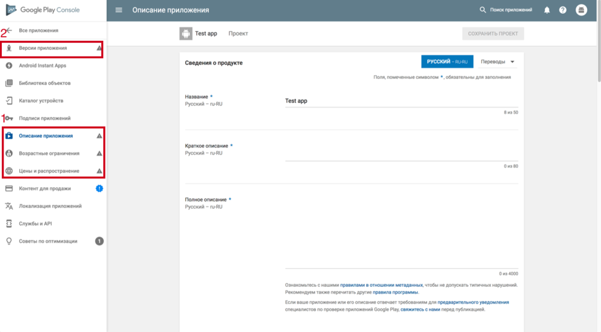

## Publishing the android application

#### 1) Create an account and application.
1. You need to have and pay for an account at [play.google.com](https://play.google.com/)
2. On the [play.google.com](https://play.google.com/apps/publish) page, create a new application and be sure to remember the bundle id.
3. After creation, you will need to complete all sections from paragraph 1. This is the "Description of the application", "Age restrictions" and "Prices and distribution.". All fields in these sections are fairly obvious and aren't tech questions.

4. For correctly filled sections, a green check mark will appear.

#### 2) APK download and beta testing.

1. Clone repository and in files ./android/app/src/main/java/com/csnative/MainActivity.java and ./android/app/src/main/java/com/csnative/MainApplication.java in the line package com .csnative replace com.csnative with your bundle id.
2. Build our application as described in [Installation and Setup](./ installation.md)
3. On the [play.google.com](https://play.google.com/apps/publish) page open your application and go to the Application Versions section.
4. Click on the "Beta version" → BETA-VERSION MANAGEMENT → then on "Create a release".
5. Download the built apk file, which is located in ./android/app/build/outputs/apk/app-release.apk
6. Click on "View".
7. Next, click "Publish Beta".

#### 3) Add testers.

1. On the [play.google.com](https://play.google.com/apps/publish) page, open your application and go to the Application Versions section.
2. Click on "Beta-version", then on "BETA-VERSION MANAGEMENT"
3. In the "Testers" section, select "Test Method" and add users (create a list by specifying email addresses or downloading a CSV file with testers).

#### 4) Publish the tested application.

1. On the [play.google.com](https://play.google.com/apps/publish) page, open your application and go to the Application Versions section.
2. Click on "Beta-version", then on "BETA-VERSION MANAGEMENT"
3. In the section, the "Make a working version" button should appear

