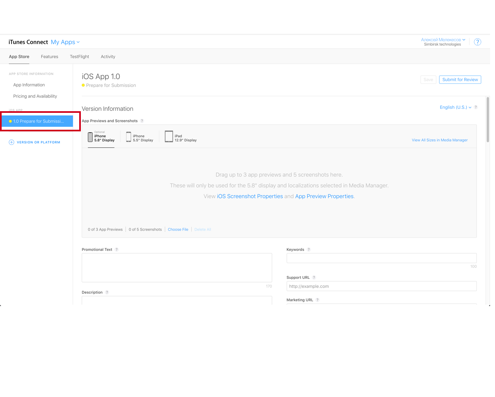
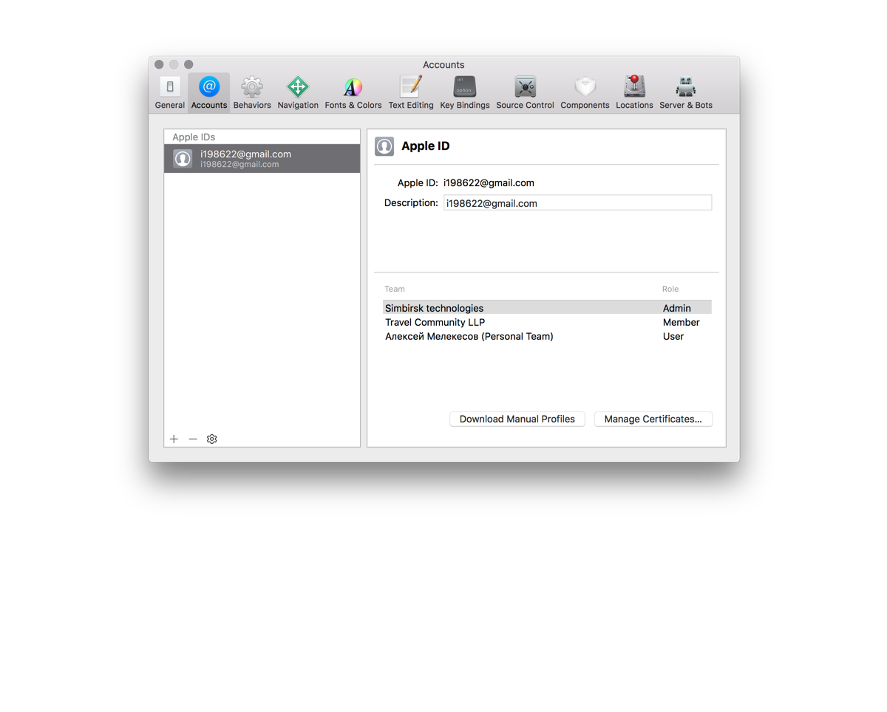
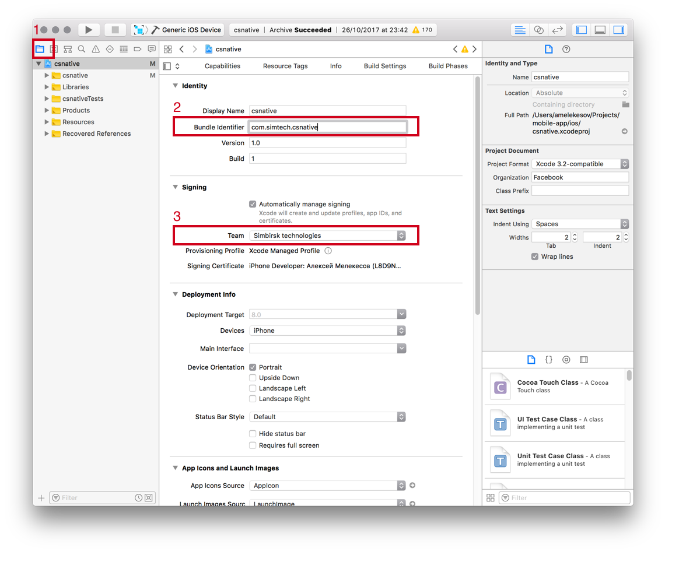
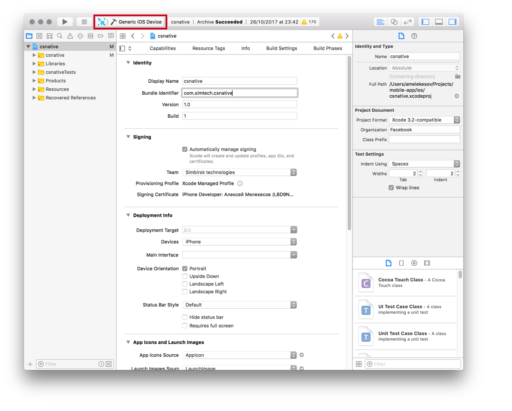

## Publishing ios application (testflight)

#### 1) Create an account and application.

1. You need to have and pay for an account in [developers.apple.com](http://developers.apple.com)
2. On the [itunesconnect.apple.com](https://itunesconnect.apple.com) page in the My Apps section, create a new application. In the name field, enter the name of your Platform application and tick the ios box. come up with a unique Bundle Id and sku for the app.
3. Go to the newly created application.
4. On the Prepare for submission tab, enter information about the application and download screenshots.

#### 2) Adding a developer.

1. On the [developer.apple.com/account](http: //developer.apple.com/account/) зфпу you need to create a new user and give him the rightы (admin).
2. After that, the developer will receive an email with a link in which he must confirm that he accepts the invite.

#### 3) Build the application and fill it in the App store.

1. Install the application sources locally [Install and configure](./installation.md)
2. Open in xcode ./ios/csnative.xcworkspace
3. Open the settings in the Xcode menu -> Preferences
4. In the Account tab, add the developer account that you created. Close the settings.

5. Go to (1) Project Navigator and change (2) the bundle identifier and select (3) team

6. Change the schema settings; for this in the menu go to Product -> Scheme -> Edit Scheme
7. Change the Build configuration field to Release
8. Choose target as Generic ios device

9. Build the archive (Building will take time!) Go to the menu Product -> Archive
10. In the side menu of the Archive window, click on Upload to App store ...

11. The download wizard will open everywhere, click Next Next and at then Upload in the end.

#### 4) Test the application in testflight

1. After successfully downloading the application in the App Store, you need to download it to the phone [testflight](https://itunes.apple.com/us/app/testflight/id899247664?mt=8)
2. Open the application in [itunesconnect.apple.com](https://itunesconnect.apple.com) in the My Apps section and go to the Testflight tab.
3. In the build field, 1 build should appear.
4. Next, go to the iTunes connect users tab and add a tester.
Tester email is required! It must be added to [itunesconnect.apple.com](https://itunesconnect.apple.com)
5. The tester will receive a confirmation code; he should click on the links and enter the received code in the testflight application.
6. The application will appear in testflight; you will only need to click on install and it will be installed on the phone.

#### 5) Publish the application in the App store

1. If everything is tested and ok, and you want to send the application for moderation in the App store. Open your app in [itunesconnect.apple.com](https://itunesconnect.apple.com)
2. Click the Prepare for submission tab.
3. Update screenshots and description (if required)
4. In the Build field, add the current build and click Submit for Review.
5. The application must pass moderation in the App store (no more than 2 days) if it has passed, it will appear in the App store; if not, then an email will come with the reason for the ban.

### Restrictions

Applications in testflight will be available for 80 days.

Apple has a confusing system of users, certificates and applications.
but if you remember that all users and certificates live on [developers.apple.com](http://developers.apple.com) and applications and statistics on [itunesconnect.apple.com](https://itunesconnect.apple.com) then there should be no problems.

