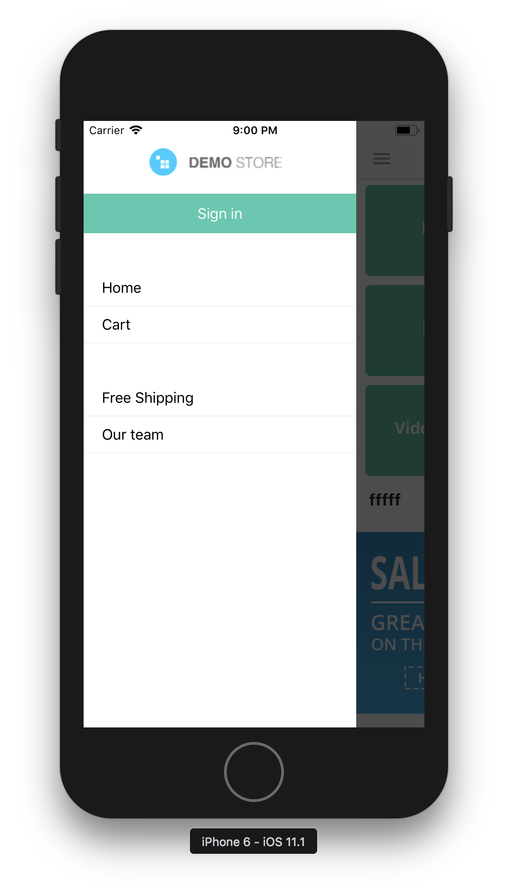

# Design settings available to the user.
PS / All user settings are stored in the config folder, except images.

### API and Site Settings

API settings of the site, etc. are stored in the file /config/index.js

* `apiKey` - API access key (generated when the option" Yes, allow the user to use the API" on the editor's page of the user is enabled).
* `baseUrl` - Base url to api. For example, `http://82.202.226.53/api/4.0/`
* `siteUrl` - URL to the site. For example, `http://82.202.226.53/` PS / May differ as the API and web version of the store may be on different servers.
* `shopName` - Online store name for example 'Shop Store'


### Appearance and colors

The design settings are stored in the /config/theme.js file PS / in the names, the `$` sign is used in order to distinguish the config settings from local variables.

* `$logoUrl` - Full path to the site logo.
* `$navBarBackgroundColor` - Changes the color of the navigation bar
* `$navBarButtonColor` - Changes the color of the navigation bar buttons
* `$navBarButtonFontSize` - Changes the size of the navigation bar buttons
* `$navBarTextColor` - Changes the text color of the navigation bar
* `$navBarRightButtonColor` - Changes the color of the right button of the navigation bar
* `$screenBackgroundColor` - Changes the screen background color
* `$contentOverlayColor` - Changes the color of the shading background when the menu is open
* `$drawerBgColor` - Changes the background color of the menu
* `$borderRadius` - Changes the degree of rounding at the buttons
* `$primaryColor` - Changes the background color of the call-to-action buttons. Examples such as add to cart.
* `$primaryColorText` - Changes the text color of the call-to-action buttons. Example: add to cart.
* `$secondaryColor` - Changes the background color of buttons calling for action 2 degrees. An example of a category button.
* `$secondaryColorText` - Changes the color of the text of the 2nd-degree CTA buttons. Example: category buttons.
* `$darkColor` - Changes the text color.
* `$successColor` - Changes the background color of notifications with the success type.
* `$infoColor` - Changes the background color of notifications with the info type.
* `$dangerColor` - Changes the background color of notifications with the danger type.
* `$statusBarColor` - Changes color of the status bar (android)

---
### Languages ​​and Locale

The language is automatically detected on the device. Translations are stored in json format in the folder config/locales/[lang].json

The default language is English.

---
### Countries and states

The /config/countries.js file stores the names and codes of countries and states.

Example:
```javascript
{
        "code": "NL",
        "code_alpha3": "NLD",
        "code_numeric": "528",
        "name": "Netherlands",
        "states": [
            {
                "code": "DR",
                "name": "Drenthe"
            },
        ]
    },
```

---
# Adding pages to the side menu.

To add pages to the side menu:


* In the admin panel in the pages section, create a parent page with the name `MobileAppSideMenu`
* All pages with the parent `MobileAppSideMenu` will be displayed in the side menu.

PS / I know it's a crutch, but there is no other option at the moment.
