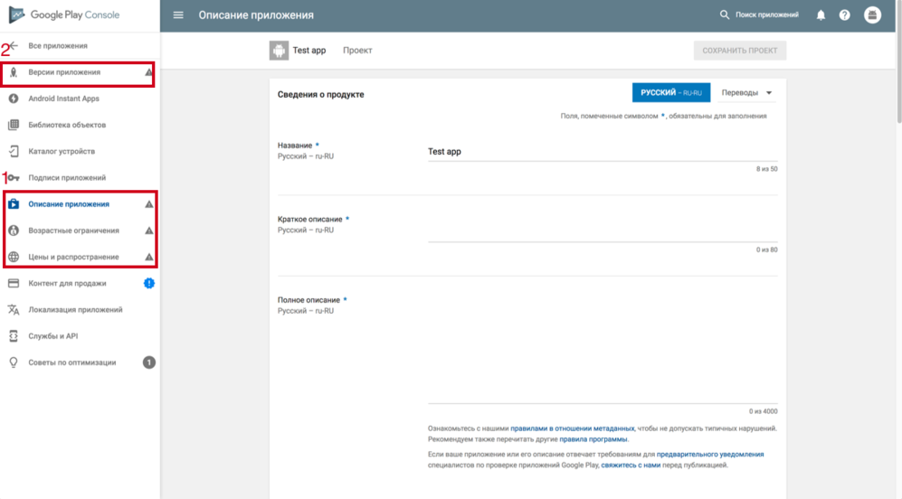

## Публикация приложения android

#### 1) Создание учетной записи и приложения.
1. Нужно завести и оплатить учетную запись в [play.google.com](https://play.google.com/)
2. На странице [play.google.com](https://play.google.com/apps/publish) Создаем новое приложение и обязательно запомнить bundle id.
3. После создания нужно будет заполнить все разделы с пункта 1. Это "Описание приложения", "Возрастные ограничения" и "Цены и распространения.". Все поля в этих разделах достаточно очевидные и не касаются тех. вопросов.

4. У правильно заполненых разделов появится зеленая галочка.

#### 2) Загрузка APK и бета тестирование.

1. Клонируем репозиторий и в файлах ./android/app/src/main/java/com/csnative/MainActivity.java и ./android/app/src/main/java/com/csnative/MainApplication.java в строке package com.csnative заменяем com.csnative на ваш bundle id.
2. Cобираем наше приложение как описано в [Установка и настройка](./installation.md)
3. На странице [play.google.com](https://play.google.com/apps/publish) открываем ваше приложение и переходим в раздел Версии приложения.
4. Нажимаем на "Бета-версия" → УПРАВЛЕНИЕ БЕТА-ВЕРСИЕЙ → далее на "Создать выпуск".
5. Загружаем собранный apk файл, который расположен в ./android/app/build/outputs/apk/app-release.apk
6. Нажимаем на "Посмотреть".
7. Далее нажимаем "Опубликовать бета-версию".

#### 3) Добавление тестировщиков.

1. На странице [play.google.com](https://play.google.com/apps/publish) открываем ваше приложение и переходим в раздел Версии приложения.
2. Нажимаем на "Бета-версия" далее на "УПРАВЛЕНИЕ БЕТА-ВЕРСИЕЙ"
3. В разделе "Тестировщики" выбрать "Метод тестирования" и добавить пользователей (создать список, указав email-адреса или загрузив CSV-файл с тестировщиками).

#### 4) Публикация протестированного приложения.

1. На странице [play.google.com](https://play.google.com/apps/publish) открываем ваше приложение и переходим в раздел Версии приложения.
2. Нажимаем на "Бета-версия" далее на "УПРАВЛЕНИЕ БЕТА-ВЕРСИЕЙ"
3. В разделе должна появиться кнопка "Cделать рабочей версией"

