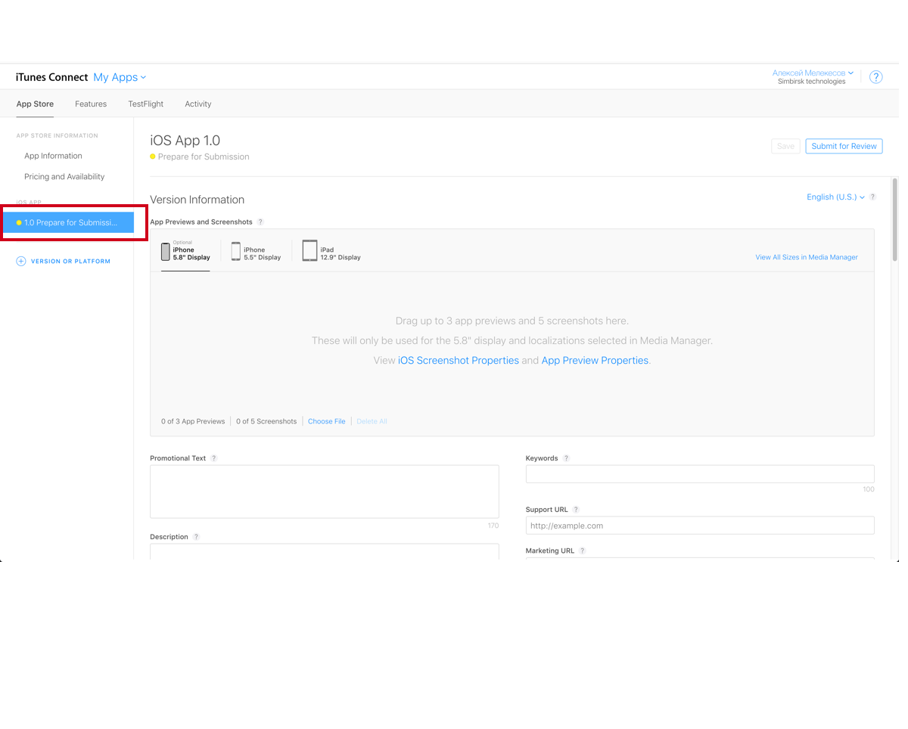
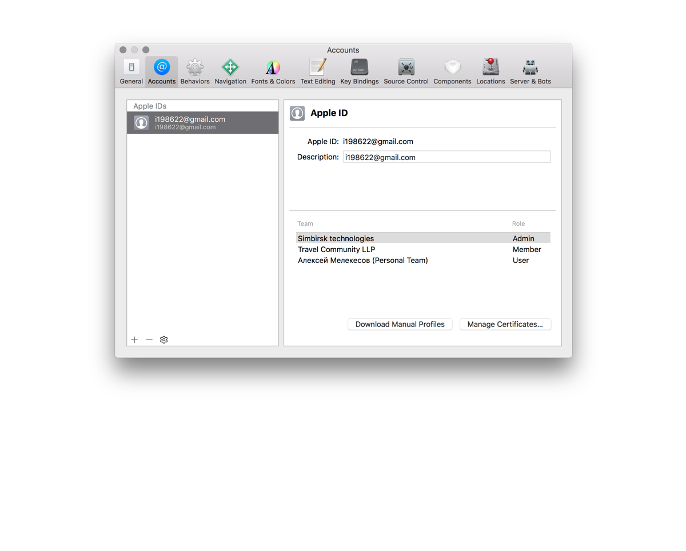
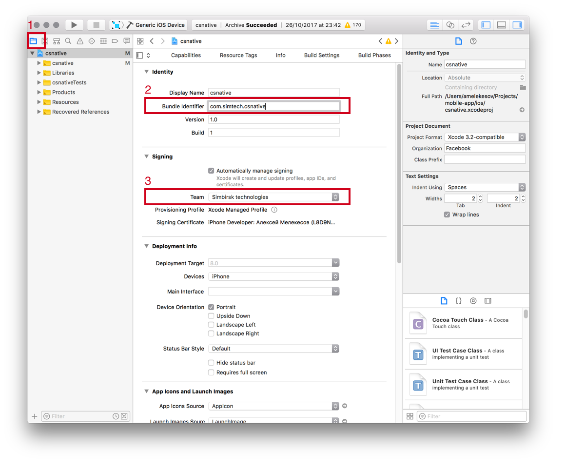
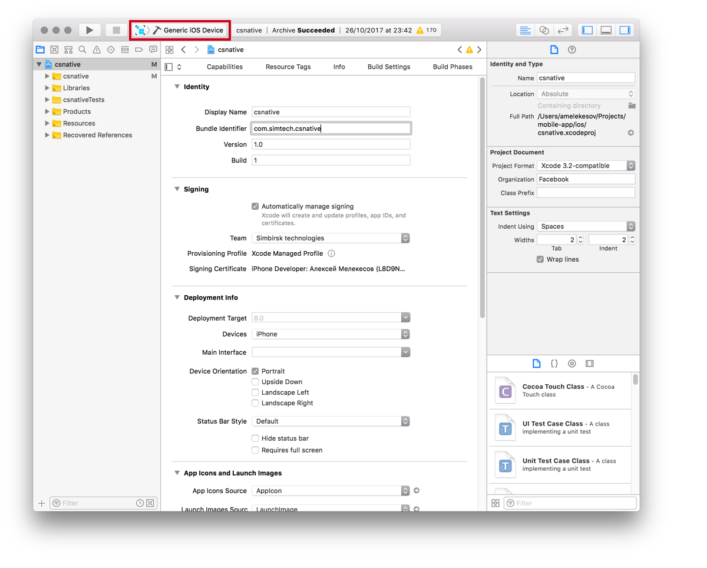
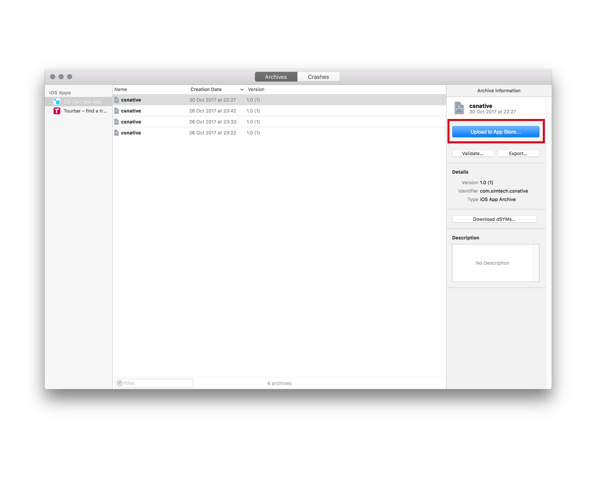

## Публикация приложения ios (testflight)

#### 1) Создание учетной записи и приложения.

1. Нужно завести и оплатить учетную запись в [developers.apple.com](http://developers.apple.com)
2. На странице [itunesconnect.apple.com](https://itunesconnect.apple.com) в разделе My Apps создать новое приложение. В поле name вписываем имя вашего приложения Platform ставим галочку у ios. придумать уникальный Bundle Id и sku для приложения.
3. Переходим в вновь созданное приложение.
4. На вкладке Prepare for submission вводим информацию о приложении и загружаем скриншоты.

#### 2) Добавление разработчика.

1. На странице [developer.apple.com/account](https://developer.apple.com/account/) нужно создать нового пользователя и дать ему права (admin).
2. После этого разработчику на почту придет письмо с ссылкой в которой он должен подтвердлить что принимает invite.

#### 3) Сборка приложения и заливка его в App store.

1. Устанавливаем исходники приложения локально [Установка и настройка](./installation.md)
2. Открываем в xcode ./ios/csnative.xcworkspace
3. Открываем настройки в меню Xcode -> Preferences
4. Во вкладке Account добавляем developer аккаунт что создавали. Закрвываем настройки.

5. Переходим в (1)Project Navigator и меняем (2)bundle identifier и выбираем (3)team

6. Меняем настройки схемы для этого в меню переходим в Product -> Scheme -> Edit Scheme
7. Меняем в поле Build configuration на Release
8. Выбираем target как Generic ios device

9. Собираем архив (Сборка займет время!) переходим в меню Product -> Archive
10. В боковом меню окна Archive нажимаем на Upload to App store ...

11. Откоется мастер загрузки везде нажимаем Next next и в конце upload.

#### 4) Тестирование приложения в testflight

1. После успешной загрузки приложения в App store нужно скачать на телефон [testflight](https://itunes.apple.com/us/app/testflight/id899247664?mt=8)
2. Открываем приложение в [itunesconnect.apple.com](https://itunesconnect.apple.com) в разделе My Apps и переходим на вкладку Testflight.
3. В поле build должен появится 1 build.
4. Далее переходим во вкладку iTunes connect users и добавляем тестера.
Email тестера обязательно! должен быть добавлен в [itunesconnect.apple.com](https://itunesconnect.apple.com)
5. Тестуру на почту придет код подтверждения нужно перейти по ссылки и в приложении testflight ввести полученный код.
6. В testflight появится приложение нужно будет только нажать на install и оно установится на телефон.

#### 5) Публикация приложения в App store

1. Если все протестировано и ок и вы хотите отправить приложение на модерацию в App store. Откройте ваше приложение в [itunesconnect.apple.com](https://itunesconnect.apple.com)
2. Перейдите во вкладку Prepare for submission.
3. Обновите скриншоты и описание (если требуется)
4. В поле Build добавьте актуальный build и нажмите Submit for Review
5. Приложение должно пройти модерацию в App store (не более 2 дней) если прошло то оно появится в App store если нет то придет письмо с причиной бана.

#### Ограничения

Приложения в testflight будет доступно 80 суток.

Apple имеет запутанную систему пользователей, сертификатов и приложений.
но если помнить что все пользователи и сертификаты живут на [developers.apple.com](http://developers.apple.com) а приложения и статистика на [itunesconnect.apple.com](https://itunesconnect.apple.com) то проблем быть не должно.

