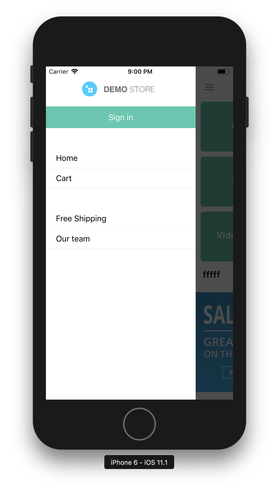

# Настройки дизайна доступные пользователю.
PS/ Все настройки пользователя хранятся в папке config/ кроме изображений.

### API и настройки сайта

Настройки API сайта и т.д хранятся в файле /config/index.js

* `apiKey` - Ключ доступа к API (генерируется при вкл. опции "Yes, allow this user to use the API" на странице  ред. пользователя).
* `baseUrl` - Базовый url до api. Например `http://82.202.226.53/api/4.0/`
* `siteUrl` - Url до сайта.  Например `http://82.202.226.53/` PS/ Может отличаться так как API и web версия магазина могут быть на разных серверах.
* `shopName` - Название интернет магазина например 'Shop Store'


### Внешний вид и цвета

Настройки дизайна хранятся в файле /config/theme.js PS/ в названиях используется знак `$` Это нужно для того что бы можно было отличить настройки конфига от локальных переменных.

* `$logoUrl` - Полный путь до лого сайта.
* `$navBarBackgroundColor` - Меняет цвет навигационного бара
* `$navBarButtonColor` - Меняет цвет кнопок навигационного бара
* `$navBarButtonFontSize` - Меняет размер кнопок навигационного бара
* `$navBarTextColor` - Меняет цвет текста навигационного бара
* `$navBarRightButtonColor` - Меняет цвет правой кнопки навигационного бара
* `$screenBackgroundColor` - Меняет цвет фона экрана
* `$contentOverlayColor` - Меняет цвет затеняющего фона при открытом меню
* `$drawerBgColor` - Меняет цвет фона меню
* `$borderRadius` - Меняет степень закругления у кнопок
* `$primaryColor` - Меняет цвет фона кнопок призывающих к действию. Пример такие как add to cart.
* `$primaryColorText` - Меняет цвет текста кнопок призывающих к действию. Пример такие как add to cart.
* `$secondaryColor` - Меняет цвет фона кнопок призывающих к действию 2 степени. Пример кнопки категорий.
* `$secondaryColorText` - Меняет цвет текста кнопок призывающих к действию 2 степени. Пример кнопки категорий.
* `$darkColor` - Меняет цвет текста.
* `$successColor` - Меняет цвет фона нотификаций с типом success.
* `$infoColor` - Меняет цвет фона нотификаций с типом info.
* `$dangerColor` - Меняет цвет фона нотификаций с типом danger.
* `$statusBarColor` - Меняет цвет статус бара (android)

---
### Языки и локаль

Язык определяется автоматически на устройстве. Переводы хранятся в json формате в папке config/locales/[lang].json
Язык по умолчанию английский.

---
### Страны и штаты

В файле /config/countries.js хранятся названия и коды стран и штатов.

Пример:
```javascript
{
        "code": "NL",
        "code_alpha3": "NLD",
        "code_numeric": "528",
        "name": "Netherlands",
        "states": [
            {
                "code": "DR",
                "name": "Drenthe"
            },
        ]
    },
```

---
# Добавление страниц в боковое меню.

Для того что бы добавить страницы в боковое меню нужно:


* В админ панели в разделе pages создать родительскую страницу с именем `MobileAppSideMenu`
* Все страницы у которых родитель `MobileAppSideMenu` будут отображаться в боковом меню.

PS/ Знаю... костыль но другого варианта в данный момент нет.